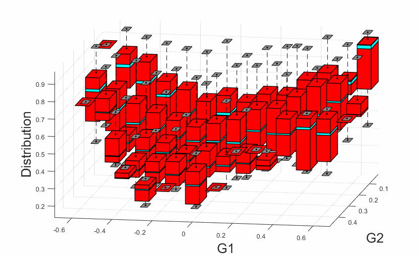
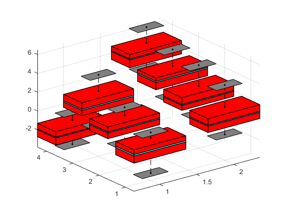
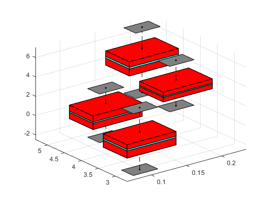
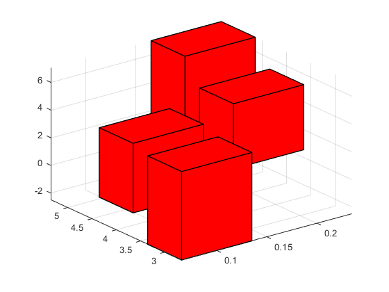
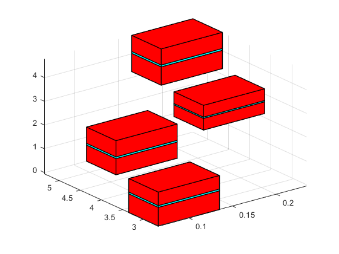

# boxPlot3D
Create three-dimensional boxplots in Matlab

  

  <body>
<h1></h1><!--introduction--><!--/introduction--><h2>Contents</h2>
<ul><li><a href="#1">boxPlot3D</a></li><li><a href="#2">Call boxplot with a single input argument</a></li><li><a href="#3">Call boxplot with grouping variables</a></li><li><a href="#4">Select the quantiles to display</a></li><li><a href="#5">Colour of the boxes</a></li></ul>
<h2 id="1">boxPlot3D</h2>
The function boxPlot3D allows you to display three dimensional boxplots and control the visualisation in many ways.
<h2 id="2">Call boxplot with a single input argument</h2>
boxPlot3D(x) creates a three dimensional box plot of the data in x. If x is 3D a matrix, boxPlot3D creates one box for each column. Example, create a 3D matrix with normal distributions with different means:

  
 <pre class="codeinput"> xx=randn(50,2,4)+repmat((permute([0 1 2 -2;1 2 3 4],[3 1 2])),[50,1,1]);
 boxPlot3D(xx)
</pre>
  
 
 
 
 <h2 id="3">Call boxplot with grouping variables</h2>
 
 
boxPlot3D(x,g1,g2) groups the data of x, with the grouping variables of g1, and g2. Example, create a 1D Matrix with different values and the corresponding grouping parameters:
<pre class="codeinput"> xx=randn(500,1)+linspace(0,5,500)';
 g1= [0.1*ones(250,1);0.2*ones(250,1)];
 g2= [3*ones(150,1);4*ones(150,1);5*ones(200,1)];
 boxPlot3D(xx,g1,g2)
</pre>

<h2 id="4">Select the quantiles to display</h2>

boxPlot3D(x,[],[],quantDistribution) allows the selection of the quantiles to select, e.g. [0 0.25 0.5 0.75 1]    [0 0.25 0.5 0.75 1] (default)  creates a box between 0.25 and 0.75                         with a line in 0.5 and two planes at 0 and 1                         connected with a dashed line. These values can be                         changed.    [ 0 1]               creates a box within the extremes of the values                          selected. These values can be changed, e.g.                          [0.25 0.75]    [ 0.25 0.5 0.75]     creates a box and a line, same as the option with                         5 values, but will not draw the planes with the                         dashed line.

<pre class="codeinput"> 

boxPlot3D(xx,g1,g2,[0 1])
boxPlot3D(xx,g1,g2,[0.25 0.5 0.75])

</pre>

<h2 id="5">Colour of the boxes</h2>
The colours of the boxes can be changed in the code.

 <a href="https://www.mathworks.com/products/matlab/">Published with MATLAB® R2018a</a> 

